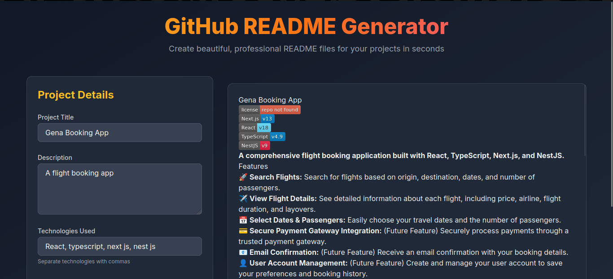

# Readme Generator

A simple Next.js app that uses the Gemini AI model to generate a comprehensive README.md file based on user input.

## Screenshots

### Homepage

## Installation

1. Clone the repository
2. Install the dependencies by running `npm install` or `yarn install`
3. Start the development server by running `npm run dev` or `yarn dev`
4. Open your web browser and navigate to `http://localhost:3000`

## How it works

1. The user inputs their project title, description, tech stack, features, requirements, and license information into the form.
2. The app sends a request to the Gemini AI model with the user input.
3. The Gemini AI model generates a comprehensive README.md file based on the user input.
4. The app displays the generated README.md file to the user.

## Tech Stack

* Next.js
* Gemini AI model
* Tailwind CSS

## License

This project is licensed under the MIT License. See the [LICENSE](LICENSE) file for details.
